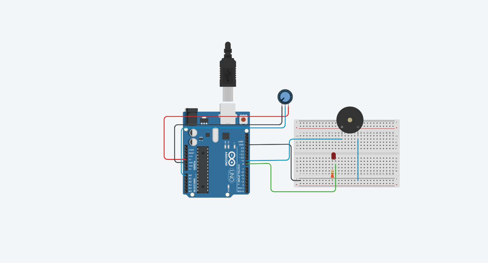

# 🌊 Sistema Físico de Monitoramento de Enchentes – Edge Computing & IoT

## 👥 Integrantes do Grupo

- [Augusto Valerio](https://github.com/Augusto-Valerio).
- [Jonas Esteves](https://github.com/Jonas-Franca).
- [Josué Faria](https://github.com/Josufaria).

---

## 🧩 Descrição do Problema

As enchentes são um problema recorrente em diversas regiões do Brasil, afetando ruas, residências e colocando vidas em risco. A ausência de sistemas preventivos acessíveis dificulta a reação rápida para minimizar os danos causados pelas inundações.

---

## 💡 Visão Geral da Solução

Este projeto propõe um sistema físico de monitoramento de enchentes utilizando Arduino e um potenciômetro para simular o nível da água. O sistema emite alertas visuais (LED) e sonoros (buzzer) ao detectar um nível crítico de alagamento.

---

## 🛠 Componentes Utilizados

- Arduino UNO
- Potenciômetro (simulando o sensor de nível)
- LED vermelho (alerta)
- Buzzer (alarme sonoro)
- (Cabos, resistores, protoboard...)

---

## ⚙ Funcionamento

1. O potenciômetro representa o aumento do nível da água.
2. Quando o valor ultrapassa o limite configurado (900), o sistema entra em alerta:
   - Acende o LED vermelho
   - Toca o buzzer uma vez
   - Mostra mensagem de alerta no Monitor Serial
3. Quando o nível volta ao normal:
   - Desliga o LED
   - Para o som do buzzer
   - Exibe mensagem de "Estado normal" no Monitor Serial

---

## 🧪 Simulação no Tinkercad

### 📌 Link para simulação

👉 [Clique aqui para acessar o projeto no Tinkercad](https://www.tinkercad.com/things/4AOuEfgCzI9-global-solution/editel?returnTo=https%3A%2F%2Fwww.tinkercad.com%2Fdashboard%2Fcollections%2F3r9jJrcG0tR%2Fcircuits&sharecode=vatStOeLH0rw1YzI5Yb70VjbH8znhpf8IYhOqaVBQlw)

### 📷 Imagem ilustrativa

---

### 🧭 Instruções para simular

1. Acesse o link da simulação.
2. Clique em "Iniciar Simulação".
3. Gire o potenciômetro para simular o aumento do nível da água.
4. Observe o LED, o buzzer e as mensagens no Monitor Serial.

---

## 📽 Vídeo Demonstrativo

🎥 [Clique aqui para assistir ao vídeo](https://www.youtube.com/watch?v=NScQ5G4TG5s)

---

## 📄 Código-fonte

O código-fonte está disponível no arquivo [codigoFonte](codigoFonte), com todos os comentários explicando cada linha e função.
